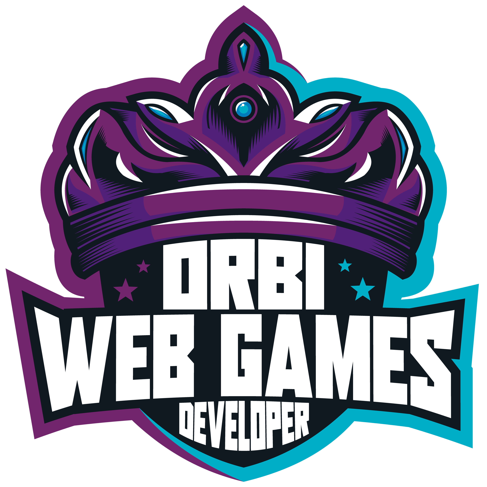

<!--Banner session-->

  

<!--About session-->
<h1 align="center">Jogo da Velha Game Digital Innovation One</h1>

Bootcamp Órbi Web Games Developer the [Digital Innovation One](https://digitalinnovation.one/).

In this project, the challenge will create a Hash game using only HTML, CSS and Javascript in an introductory way, the main concept being CSS, Array manipulation and Arrow Functions.
- [Project developed](https://jogodavelhabyvictor.netlify.app/)

<h3>👨‍💻 Technologies used</h3>

- [HTML](https://www.w3schools.com/html/)
- [CSS](https://developer.mozilla.org/pt-BR/docs/Web/CSS)
- [JavaScript](https://developer.mozilla.org/en-US/docs/Web/JavaScript)

<h3> :calling: Preview Project</h3>
<h1 align="center">
  
</h1>
<!--Bottom session-->
 <h4 align=center>Made with by <a target="_blank" href="https://github.com/victordandolini" >Victor Dandolini</a></h4> 
